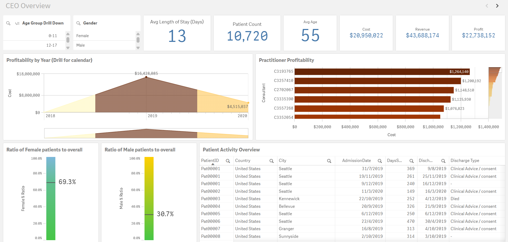
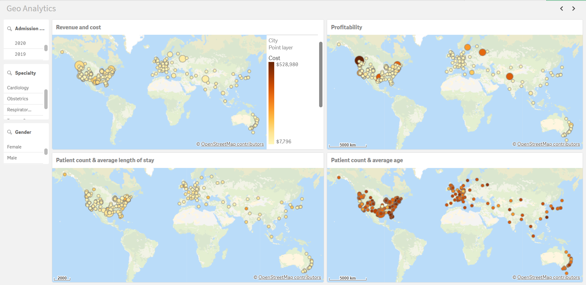
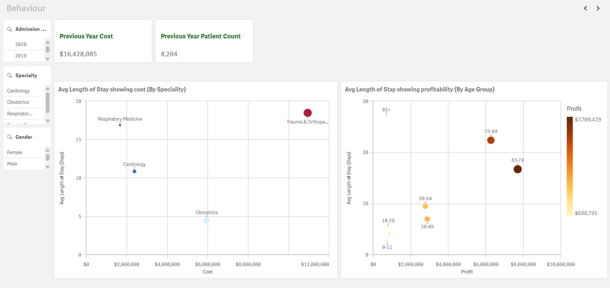
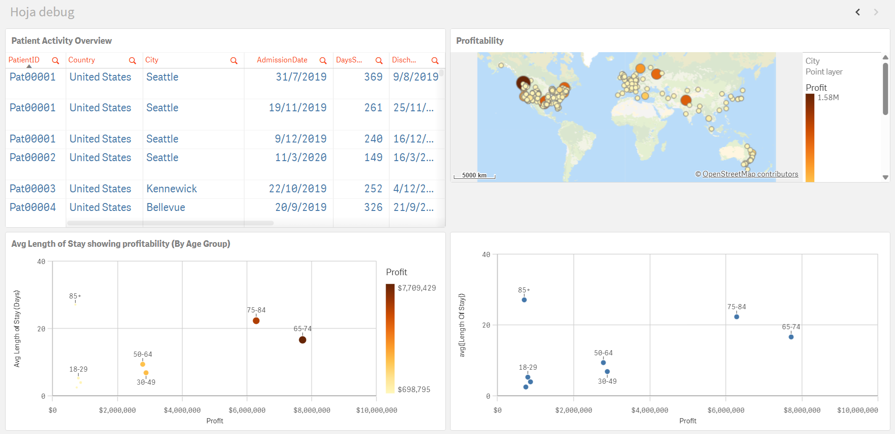

# qlik-patients
Report with sample data for the QSDA certification. It analyzes patient hospitalization data to identify trends in length of stay, costs, and demographic patterns.

## Dashboards:

Vista CEO:

Mapas:

Sheet para pruebas:

